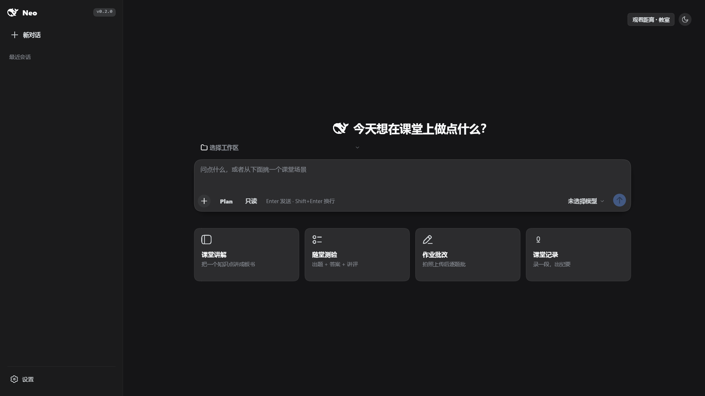
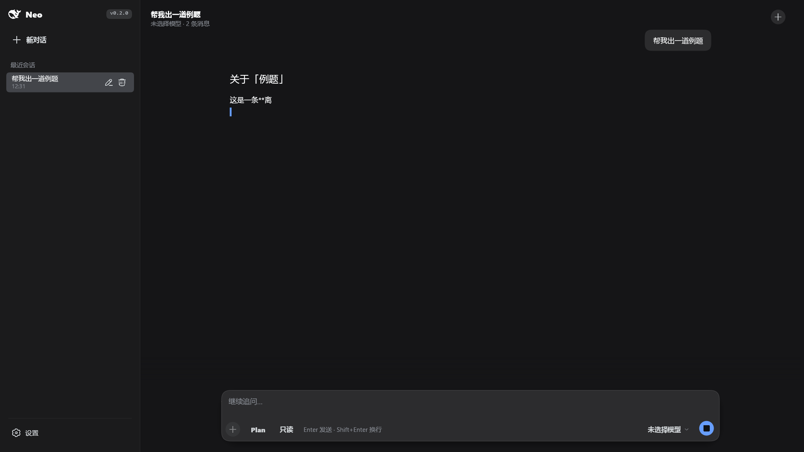
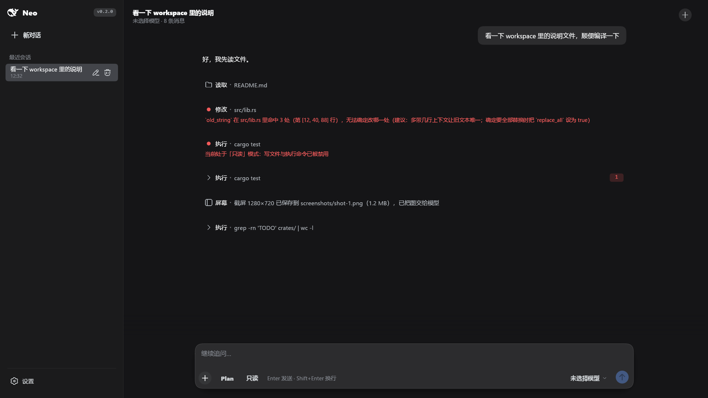
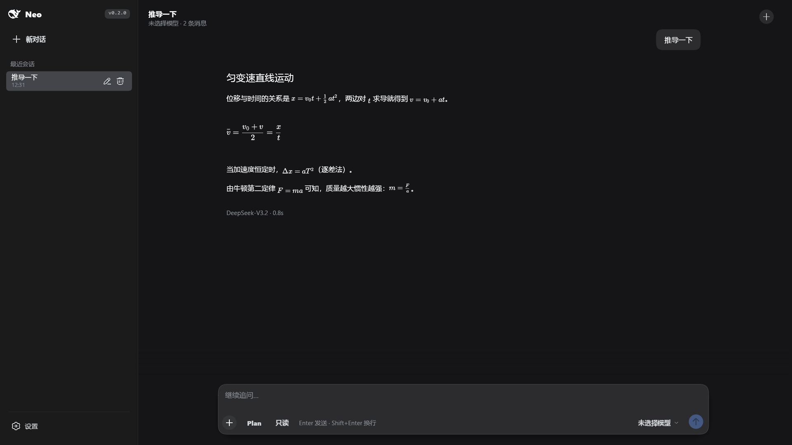

<div align="center">

# Neo

**A voice-first AI assistant for classroom big screens.**

Say *“Hi Neo”* — a flowing marquee lights up along the screen edges, refracting the live desktop beneath it. Speak, and Neo transcribes, reasons, streams answers, and operates the local machine through tools. When idle, it retreats to the system tray and waits for the next call.


</div>

---

## Table of Contents

- [Overview](#overview)
- [Features](#features)
- [Screenshots](#screenshots)
- [Requirements](#requirements)
- [Getting Started](#getting-started)
  - [Model & Runtime Assets](#model--runtime-assets)
- [How It Works](#how-it-works)
- [Architecture](#architecture)
- [Versioning](#versioning)
- [Design Principles](#design-principles)
- [Acknowledgments](#acknowledgments)
- [License](#license)

## Overview

Neo is a Windows desktop AI assistant built for **classroom big screens** — touch all-in-ones running at 1080p or 4K, viewed from several meters away.

The full interaction loop is voice-driven:

1. **Wake** — the always-on wake-word engine detects “Hi Neo” locally.
2. **Reveal** — a fullscreen transparent overlay renders a flowing marquee along the screen edges, sampling the desktop 30 times per second for real-time edge refraction, breathing with the audio level.
3. **Listen** — speech is segmented by VAD and transcribed fully offline.
4. **Respond** — the LLM streams its reply, rendered as Markdown / KaTeX, and may invoke local tools (screenshots, files, shell, UI automation). Everything is stoppable at any moment.
5. **Rest** — Neo sinks back into the system tray.

The visual language is adapted from **DeepSeek Harness** (`@deepseek-ai/dsh`). Big-screen and touch adaptation, the voice pipeline, the marquee effect, and the tool chain are original work — independent implementations, not upstream ports.

## Features

- **On-device wake word** — a re-implementation of the `livekit-wakeword` inference chain (melspectrogram → speaker embedding → wake-word classifier), running entirely on local ONNX models. 16 kHz input, 80 ms frames, 2 s sliding window.
- **Offline speech-to-text** — Silero VAD for endpointing + SenseVoice-Small (int8) for recognition, powered by sherpa-onnx in-process. No network dependency.
- **Refraction marquee overlay** — a fullscreen transparent window (a port of the VCC *edgeglow v2* effect) on DX12 + DirectComposition with a transparent swap chain. A 30 fps capture thread feeds the shader for live edge refraction; the overlay excludes itself from capture (`WDA_EXCLUDEFROMCAPTURE`) to prevent feedback loops.
- **Streaming conversation** — OpenAI-compatible `/chat/completions` client (DeepSeek by default), with Markdown and KaTeX rendering. Generation can be stopped at any time — even mid-tool-execution.
- **Local tool chain** — file read/write/edit, PowerShell and Bash (via a bundled portable Git Bash), screenshots, UI automation (click / drag / UIA element search), and document attachment parsing. Dangerous actions are gated behind explicit confirmation dialogs.
- **Big-screen adaptation** — a density × distance scaling chain (`viewport height / 1080 × distance factor`) with a 48 pt touch-target floor. Every scaling parameter is inspectable live in the Display settings panel.
- **Tray-resident** — the app lives in the system tray between sessions; the overlay window and the egui UI run on decoupled threads.

## Screenshots

| Idle · dark · 1080p | Generating (stoppable) |
|:---:|:---:|
|  |  |

| Tool cards | Math rendering (KaTeX port) |
|:---:|:---:|
|  |  |

<details>
<summary><b>More snapshots</b> — light theme, 4K far-view, tool confirmation dialogs, settings panels</summary>
<br>

The full gallery lives in [`docs/screens/`](docs/screens/), including:

- Light theme & 4K far-view hero states
- Tool confirmation dialogs (normal / long-content / scrolled)
- Settings panels (appearance, model, display)
- Attachment chips & Markdown/CommonMark rendering edge cases
- Session action sheets & reasoning traces

</details>

## Requirements

| Requirement | Notes |
|---|---|
| **Windows 10 2004 (20H1) or later** | The capture-exclusion API (`WDA_EXCLUDEFROMCAPTURE`) is available from 2004 onward. |
| **DX12-capable GPU** | Required by the overlay's wgpu backend. |
| **Rust 1.95+** | Workspace-wide `rust-version`. |

> [!NOTE]
> On Windows 10 builds older than 2004 (or in remote sessions where capture exclusion fails), Neo still runs — the overlay automatically degrades to a halo-only mode without desktop refraction, so the marquee can never feed back into its own capture.

## Getting Started

```bash
cargo run --release   # release is recommended: 60 fps at 4K
cargo test            # unit tests + offscreen render snapshots (output: docs/screens/)
```

### Model & Runtime Assets

| Asset | Location | Source |
|---|---|---|
| Wake-word models (~3 MB) | `crates/neo-wake/assets/` | **Vendored in the repo** — nothing to do |
| STT models (~240 MB) | `crates/neo-stt/assets/` (git-ignored) | Official sherpa-onnx models (available via hf-mirror): `sense-voice/model.int8.onnx` + `tokens.txt`, and `vad/silero_vad.onnx`. Alternatively point `NEO_STT_MODEL_DIR` at any directory containing them |
| Portable Git Bash runtime (~91 MB) | `runtime/` (git-ignored) | `python tools/fetch_runtime.py`. If missing, the Bash tool is unavailable; the PowerShell tool is unaffected |

Expected STT layout:

```text
crates/neo-stt/assets/
├── sense-voice/
│   ├── model.int8.onnx
│   └── tokens.txt
└── vad/
    └── silero_vad.onnx
```

> [!IMPORTANT]
> Without the STT models the app still launches, but voice transcription is disabled. Without the portable runtime, only the Bash tool is affected — everything else works.

## How It Works

```text
 microphone ──▶ neo-wake ──▶ wake event ──▶ neo-overlay (marquee on)
                   │                              │
                   ▼                              ▼
              neo-stt (VAD + SenseVoice)    desktop capture @30fps
                   │                              │
                   ▼                              ▼
              transcript ──▶ neo-llm (streaming) ──▶ neo-tools (confirm → execute)
                   │
                   ▼
              neo-app (egui UI, tray, session orchestration) ──▶ neo-store (SQLite)
```

- The **overlay** owns its own window thread and wgpu/DX12 renderer, fully decoupled from the egui main UI. Desktop frames travel one-way: capture thread → channel → GPU texture upload, with defensive frame validation at the boundary.
- The **voice state machine** in `neo-app` orchestrates wake → listen → transcribe → generate → rest, and owns the tray lifecycle.
- The **tool chain** separates spec, confirmation policy, execution, and result presentation, so every dangerous action can be intercepted before it runs.

## Architecture

| Crate | Responsibility |
|---|---|
| `neo-app` | Main binary: eframe UI, voice state machine, system tray, per-turn orchestration |
| `neo-ui` | Custom-drawn component library (buttons, modals, lists, badges, fields, …) |
| `neo-theme` | Design system: semantic palette, metrics & scaling chain, font assembly, squircle corners |
| `neo-llm` | OpenAI-compatible `/chat/completions` streaming client; function-calling protocol transport |
| `neo-tools` | Local tool set: spec / confirmation policy / execution / result presentation |
| `neo-wake` | Wake-word engine (microphone → mel → embedding → wake-word scoring) |
| `neo-stt` | Local speech-to-text (VAD endpointing + offline SenseVoice recognition) |
| `neo-overlay` | Marquee overlay: dedicated window thread + wgpu/DX12 rendering, decoupled from egui |
| `neo-store` | Session & message persistence (SQLite) |

<details>
<summary><b>Workspace layout</b></summary>
<br>

```text
Neo/
├── Cargo.toml            # workspace root — the single source of truth for the version
├── crates/               # the 9 crates above
├── docs/
│   ├── design-spec.md    # GUI design specification
│   ├── design-kit.md     # neo-ui component manual
│   └── screens/          # render snapshots
├── tools/                # fetch_runtime.py, icon generation/extraction
├── vendor/
│   └── egui_commonmark/  # locally patched Markdown renderer ([patch.crates-io])
└── wake-training/        # wake-word training scripts & configs (data/output git-ignored)
```

</details>

## Versioning

The single source of truth is `[workspace.package].version` in the root [`Cargo.toml`](Cargo.toml). All crates inherit it via `version.workspace = true`, and the version shown in the UI (Settings panel) is injected at build time through `env!("CARGO_PKG_VERSION")`. **To cut a new version, change that one line.**

## Design Principles

1. **Visual fidelity first; adaptation happens through non-visual channels.** The upstream shape language (corner radii, button sizes, type rhythm) is never re-invented. Big-screen adaptation is limited to uniform proportional scaling and touch-target expansion.
2. **Scaling must be visible.** The final scale-factor formula is laid out in full in the settings panel, so on-site troubleshooting starts with the answer already on screen.
3. **Keep egui only for what it does best.** Text editing and scroll clipping use native egui; everything else is custom-drawn. Wrestling default widgets into shape produces something that neither resembles the upstream design nor stays usable.

## Acknowledgments

- [DeepSeek Harness](https://github.com/deepseek-ai) (`@deepseek-ai/dsh`) — visual language
- [livekit-wakeword](https://github.com/livekit) — wake-word inference chain design
- [sherpa-onnx](https://github.com/k2-fsa/sherpa-onnx) — in-process ONNX inference (SenseVoice, Silero VAD)
- [egui](https://github.com/emilk/egui) / [wgpu](https://github.com/gfx-rs/wgpu) — UI & rendering foundations

## License

[MIT](Cargo.toml)
