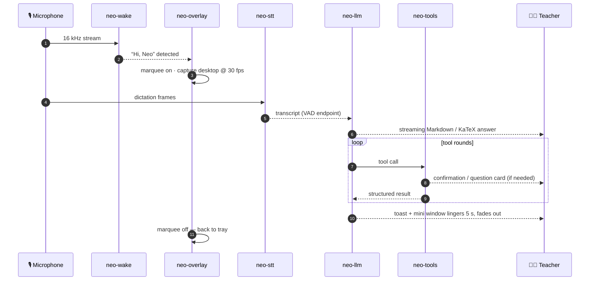
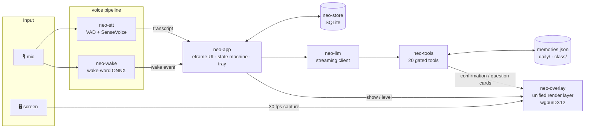
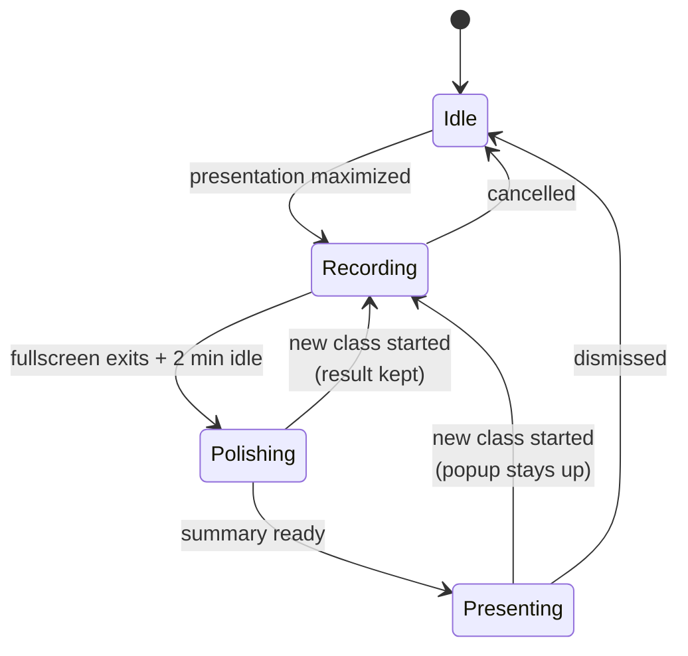
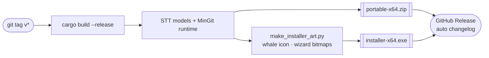

<div align="center">

# Neo

**A voice-first AI teaching assistant for classroom big screens.**

Say *“Hi, Neo”* — a liquid-glass lens wakes along the screen edges, refracting the live desktop
beneath a band of flowing color. Speak, and Neo transcribes, reasons, answers in streaming
Markdown / KaTeX, and operates the machine through a gated local tool chain. When the work
is done, it fades back into the system tray and waits for the next call.

[](https://github.com/ChidcGithub/Neo/releases)
[](https://github.com/ChidcGithub/Neo/actions/workflows/release.yml)
[](#requirements)
[](#build-from-source)
[](#license)

</div>

---

## Table of Contents

- [Overview](#overview)
- [Feature Highlights](#feature-highlights)
- [Screenshots](#screenshots)
- [The Voice Loop](#the-voice-loop)
- [Requirements](#requirements)
- [Download & Install](#download--install)
- [Build from Source](#build-from-source)
- [Architecture](#architecture)
- [Classroom Mode](#classroom-mode)
- [Memory](#memory)
- [Tool Chain](#tool-chain)
- [Safety & Privacy](#safety--privacy)
- [Versioning & Releasing](#versioning--releasing)
- [Design Principles](#design-principles)
- [Acknowledgments](#acknowledgments)
- [License](#license)

## Overview

Neo is a Windows desktop AI assistant built for **classroom big screens** — touch
all-in-ones running at 1080p or 4K, read from several meters away. It is designed around
three observations about real classrooms:

1. **The teacher's hands are busy.** The primary interface is voice: wake word →
   dictation → answer. Everything else is secondary.
2. **The screen belongs to the lesson.** Neo must be *absent* until called — no taskbar
   icon competing for attention, no window chrome over the slides. When it does appear,
   it appears as light: a lens of flowing color along the edges, a small card in the
   corner, a question dialog in the center — then it leaves.
3. **Classroom machines are hostile environments.** Spotty networks, aggressive
   antivirus, no admin rights, and an audience. Neo's audio pipeline is fully offline,
   its installer is per-user (no UAC), and every mutating tool call is gated behind an
   explicit on-screen confirmation.

The visual language is adapted from **DeepSeek Harness** (`@deepseek-ai/dsh`).
Big-screen and touch adaptation, the voice pipeline, the liquid-glass overlay, the
classroom monitor, and the tool chain are original work — independent implementations,
not upstream ports.

## Feature Highlights

| | |
|---|---|
| 🎙️ **On-device wake word** | Re-implementation of the `livekit-wakeword` inference chain (mel → speaker embedding → wake classifier) on local ONNX models. 16 kHz input, 80 ms frames, 2 s sliding window. |
| 🗣️ **Offline speech-to-text** | Silero VAD endpointing + SenseVoice-Small (int8) via in-process sherpa-onnx. Zero network dependency. |
| 🌊 **Liquid-glass marquee** | Fullscreen transparent overlay on DX12 + DirectComposition: live desktop capture drives real-time **refraction with chromatic dispersion, Fresnel rim light, and roughness blur**, wrapped in a theme-blue band that hugs the screen edges — corners included. Breathes with the mic level. |
| 🪟 **Separate visual and input layers** | Passive status cards and effects share a persistent, click-through overlay. Confirmation, question and classroom dialogs use independent opaque windows that receive input; the visual overlay never takes focus. |
| 💬 **Streaming conversation** | OpenAI-compatible `/chat/completions` client (DeepSeek by default) with CommonMark + KaTeX rendering (a Rust port of KaTeX's layout). Cancellable at any moment — even mid-tool-execution. |
| 🛠️ **Gated local tools** | 20 tools: files, documents, shell (PowerShell + bundled Git Bash), screenshots, UIA automation, web search, memory. Write/exec actions require on-screen confirmation first. |
| ❓ **Ask-the-user tool** | When the model is unsure, `ask_user` pops a question card with tappable options instead of guessing. |
| 🧠 **Three-tier memory** | Long-term profile (`remember`/`forget`, injected into every prompt) · **daily notes** with a gist index (`note_day`/`recall_day`, index-first lookup) · per-day **class notes** written by the classroom monitor. |
| 🖥️ **Classroom mode** | Detects when a presentation goes fullscreen → silently captures + transcribes the lesson → polishes a summary when the class ends → slides in a summary card. A tiny red dot in the corner marks summary start/finish. |
| 🪟 **Mini window** | While Neo works in the background: tool flow + reply body (Markdown/LaTeX) in a corner card that dodges the cursor, auto-sizes to the final paragraph, and fades out after a 5 s dwell. |
| 🔔 **Native notifications** | Windows toasts on startup and task completion; the release build never flashes a console window. |

## Screenshots

Offscreen render tests write snapshots to the local `docs-pri/screens/` directory.
The `docs-pri/` directory is not tracked in Git; screenshots are not included in a clone.
The root README is public; internal guides and audit reports remain local.

## The Voice Loop


```mermaid
sequenceDiagram
    autonumber
    participant Mic as 🎙️ Microphone
    participant Wake as neo-wake
    participant Overlay as neo-overlay
    participant STT as neo-stt
    participant LLM as neo-llm
    participant Tools as neo-tools
    participant User as 👩‍🏫 Teacher

    Mic->>Wake: 16 kHz stream
    Wake-->>Overlay: “Hi, Neo” detected
    Overlay->>Overlay: marquee on · capture desktop @ 30 fps
    Mic->>STT: dictation frames
    STT-->>LLM: transcript (VAD endpoint)
    LLM-->>User: streaming Markdown / KaTeX answer
    loop tool rounds
        LLM->>Tools: tool call
        Tools-->>User: confirmation / question card (if needed)
        Tools-->>LLM: structured result
    end
    LLM-->>User: toast + mini window lingers 5 s, fades out
    Overlay->>Overlay: marquee off — back to tray
```

## Requirements

| Requirement | Notes |
|---|---|
| **Windows 10 2004 (20H1), build 19041, or later** | Minimum supported OS, including Windows 11. Capture exclusion (`WDA_EXCLUDEFROMCAPTURE`) requires 2004+. |
| **Native x64 (AMD64) Windows** | 32-bit Windows and ARM64 (including x64 emulation) are unsupported. The installer rejects them before unpacking. |
| **DX12 or OpenGL-capable GPU** | DX12 is preferred; OpenGL is the main-window fallback. The desktop-refraction overlay requires DX12. |
| **Microphone** | For wake word & dictation. Everything else works without one. |
| **Rust 1.95+** | Only for building from source. |

> [!NOTE]
> Windows builds older than 19041 are unsupported; halo-only rendering does not
> lower the OS requirement. On supported systems where capture exclusion fails
> (for example, some remote sessions), the overlay falls back to halo-only mode
> without desktop refraction to avoid capture feedback.

### Automatic renderer selection

On first launch (and after a version change), Neo tests **DX12 first, then OpenGL**
inside separate, time-limited processes. Vulkan is deliberately excluded because
some drivers crash during enumeration. The compact, square-cornered startup card
shows an indeterminate progress bar flush with its bottom edge during initialization.

The working renderer is cached in `%APPDATA%\Neo\graphics.json` (or
`NEO_HOME/graphics.json`). If initialization crashes before the first main-window
frame is confirmed, the **next launch** skips that backend. OpenGL mode uses the
existing auxiliary-window fallback without the DX12 refraction overlay.

After updating a faulty graphics driver, close Neo and run `neo.exe --reset-renderer`
to probe again. The cache directory must be writable; initialization guidance is
written to `graphics-help.txt` in the startup log directory on failure.

## Download & Install

The workspace version is **`0.1.0-pre11`**. The release workflow builds and
publishes binaries after technical checks; see Releases for available packages.
The earlier [pre10 source prerelease](https://github.com/ChidcGithub/Neo/releases/tag/v0.1.0-pre10)
is unchanged. The source tree includes some tracked binary assets.

When binary packages are available, the
[Releases](https://github.com/ChidcGithub/Neo/releases) page will use these names:

| Artifact | Shape | Pick it if… |
|---|---|---|
| `neo-<ver>-<variant>-installer-x64.exe` | NSIS wizard (per-user, **no admin rights needed**) | You want Start Menu / Desktop shortcuts and an entry in *Apps & Features* |
| `neo-<ver>-<variant>-portable-x64.zip` | Zip with everything inside | You want to unpack-and-run, or keep it on a USB stick |

The packaging workflow prepares the same payload for both formats: `neo.exe`, wake-word models, STT models
(SenseVoice int8 + Silero VAD), drawing/blackboard with DirectML, and GCM-free Git Bash.
Only the blackboard math-recognition model differs between **INT8** and **FP32**.
Choose one variant; both use the same installation and user-data locations.
INT8 uses the pre-quantized [model asset](https://github.com/ChidcGithub/Neo/releases/tag/models-texteller-int8-v1);
FP32 comes from a pinned upstream revision. CI checks sizes and SHA-256 values.
Both formats and variants must succeed before a single Release is published.

> [!TIP]
> The installer is unsigned for now — Windows may show a SmartScreen warning.
> User data (database, memories) lives in `%APPDATA%\Neo` by default and survives
> uninstalls. The portable bundle also uses this data location by default.

### Updates, backups & removal

- **Update checks only read public GitHub release metadata.** Automatic checking
  can be disabled in settings; Neo does not automatically download or install
  updates. Open the release page and download the chosen package yourself.
- **Before upgrading**, exit Neo and back up `%APPDATA%\Neo` (or your `NEO_HOME`)
  and any custom installation resources. The installer stages the new payload,
  then swaps directories; it attempts rollback on failure. After a successful
  upgrade, the complete old directory is retained at the backup path printed in
  the installation details. Custom resources remain in that backup, not merged
  into the new installation. Inspect it before manually cleaning it up; do not
  delete a backup needed for recovery.
- **Uninstall preserves resources:** without a per-file ownership manifest, only
  known top-level program files, shortcuts and the uninstall registration are
  removed. Nonempty `resources/`, `runtime/`, `docs/`, legacy `assets/` and
    `assets-stt/`, and unknown files remain,
  as does user data. Review and back up these leftovers before manual removal.
- **Reinstall:** the current uninstaller records the retained directory's identity
  in HKCU so the installer can recognize it for the same user. If an older
  uninstaller left a nonempty directory without this record, rename that directory
  to preserve it, then install at the original path (or use a new empty directory).
  Do not delete custom files or fabricate a residue record to bypass the check.
- **Microsoft Visual C++ x64 runtime is an external prerequisite.** The installer
  checks for version **14.51.36247.0** or newer. Install it from
  [Microsoft](https://learn.microsoft.com/en-us/cpp/windows/latest-supported-vc-redist);
  Neo does not bundle CRT DLLs or install this prerequisite automatically.

These are the current installer policies, not a claim that clean Windows 10
install/upgrade/uninstall/reinstall acceptance has passed.

## Build from Source

On Windows x64, install Rust 1.95+, Python 3.11+ and the Visual Studio C++ build
tools / Windows SDK. Prepare the no-TTS Sherpa native libraries before Cargo:

```bash
python -B tools/prepare_sherpa_ci.py
cargo build --locked --release -p neo-app
```

Native preparation downloads pinned build inputs. Missing or mismatched inputs
fail the build instead of falling back to the former TTS-enabled libraries.
Speech recognition models and the Bash runtime are separate assets (see below).

### Drawing and blackboard integration

The floating menu opens **画板 / Drawing** (transparent annotations) or
**黑板 / Blackboard**. Voice commands `打开画板`, `打开白板`, `打开黑板`,
`open drawing`, `open whiteboard`, and `open blackboard` are handled locally
only when no draft, attachment or task would be displaced.

Install trusted, separately built hosted applications at:

```text
apps/drawing/neo-drawing.exe
apps/blackboard/neo-blackboard.exe
```

Paths are relative to `neo.exe`, not the working directory. Each app runs with
`--gui --hosted` in its own directory. For local development, set
`NEO_DRAWING_DIR` and `NEO_BLACKBOARD_DIR` to trusted absolute directories
containing the corresponding executables and required runtime dependencies;
both may point at the same build directory. Neo does not search neighboring
repositories or PATH, download models, or start either app at startup.

The integration implements bounded bidirectional JSONL communication, capability
checks, permission configuration, show/state/close and one process per app. Ready timeout
is 10 seconds; requests time out after 5 seconds (close: 15 seconds). Timeout
or EOF is not proof of hidden windows or successful shutdown. Unsaved boards
block Neo exit; save or close them in their own UI. No force-kill or silent discard.

**Hosted screenshots:** outside classroom safe mode, a board's capture button
requests Neo's region selector. Neo waits for the requesting board, its own
windows, floating control and overlay to confirm hiding. PNGs stay in memory,
are transferred in bounded chunks with CRC32, and are released or expire.
Esc, right-click, loss of focus, topology changes, disconnect and cancellation
abort the selection. Window restoration and cancellation acknowledgment wait
for the capture worker to finish cleanup. Capture currently requires exactly
one hosted board; close the other board first.

**Board Agent:** uses Neo's selected model and endpoint. A second Neo confirmation
shows the question, image count and destination before any board image is read
or uploaded. For images, the user must confirm the selected model supports
image input; this is not provider capability verification. Requests contain only
the authorized question/images and, only in structured-edit mode, the authorized
current-page object snapshot; never Neo history or other pages. Images may be
resized/transcoded. Up to four static PNGs are accepted, at most 8 MiB each and
32 MiB total decoded data. Provider errors do not trigger an image-free retry.

**Write-back:** requires permission in both the board and Neo. By default the
answer is appended as one text object. Enable the separate **read current page
and add/modify/delete drawing objects** checkbox for structured editing. Neo
then reads a revision-pinned snapshot of the current page and sends its non-image
objects to the selected model. This includes existing text: the panel explicitly
asks for that data-sharing permission before reading.

Structured edits support function plots, 2D shapes/projected 3D wireframes,
coordinate systems, text, math layouts and strokes. Updates/deletes target only
IDs from the authorized snapshot; updates retain object type. New IDs are
assigned locally. Images, connection graph editing, other pages, files, arbitrary
RPC and executable commands are excluded. All proposed operations are validated
as strict JSON and submitted atomically with one undo step; any invalid operation
rejects the entire response, without a text fallback or partial application.

The host limits a page snapshot to 256 objects / 128 KiB (large objects are read
in chunks), a response to 16 KiB and a batch to 64 operations. Model context limits
may be lower. Oversized requests fail rather than silently omit content. The
board remains the final validator of document/page/revision, connections and
function support. Expression token validation does not guarantee a function can
be plotted. Neo conservatively cancels on page changes; conflicts never auto-retry edits.

Host jobs use a 60-second cooperative deadline and direct final responses.
Cancellation suppresses later write-back, but cannot recall uploaded data or
force-stop a blocked HTTP/system call. Configuration changes revoke queued
responses until transmission starts. Resources and jobs are isolated per
connection; disconnect invalidates results and starts cleanup.

Ordinary Neo desktop tools still refuse work while any hosted board is open,
including hidden/disconnected instances. Hosted region capture uses its separate
confirmed-hide path; no external board lease is treated as safe across EOF.

The combined-release workflow builds the pinned drawing project and packages its
applications and runtime files after source, build and package checks pass.
Math-recognition models are installed under the blackboard application's
`models/texteller-int8/` or `models/texteller/`; ordinary drawing does not require them. Native GUI/real-host acceptance
remains separate from synthetic protocol tests.

### Interface language

Choose **设置 → 通用 → 语言 / Settings → General → Language** to switch between
简体中文 and English. The choice is saved and applies immediately to interface labels.
User content, model replies and original diagnostic details are not translated.

Catalogs are UTF-8 JSON objects in `resources/lang/zh-CN.lang` and `en-US.lang`.
Keys are Chinese source strings; named placeholders such as `{count}` must be
preserved in translations. Packaged catalogs take precedence over development
catalogs and embedded defaults. Missing or invalid entries fall back safely;
restart Neo after editing a file. Both catalogs are required in release packages.

### Directory layout

- `crates/`, `tools/`, `vendor/`: source, development tools and vendored code.
- `resources/lang/`: Chinese and English interface catalogs.
- `.cache/`: downloaded runtime and model packaging inputs.
- `target/package/`: packaging intermediates and installer art; `target/logs/`: local development logs.
- `dist/`: assembled package, portable archive and installer; `dist/archive/` preserves older local artifacts without modifying their internal layout.
- `README.md`: public project guide; `docs/licenses/`: required license material.
- `docs-pri/`: untracked internal guides and audits; `wake-training/`: training scripts.

The package root contains `neo.exe`, `LICENSE` and `NOTICE`.
Models live in `resources/models/wake/` and `resources/models/stt/`; ONNX Runtime
lives in `runtime/onnx/`, and GCM-free Git Bash in `runtime/gitbash/`.
Hosted applications live in `apps/drawing/` and `apps/blackboard/`.
The installer additionally provides its icon and uninstaller.

Legacy package `assets/`, `assets-stt/` and repository-root `runtime/gitbash/`
are no longer auto-discovered. Use the new layout rather than replacing only
`neo.exe` in an old package. Packaged Git Bash remains at `runtime/gitbash/`
next to the executable; development uses `.cache/runtime/gitbash/`.
Environment overrides and crate-local development assets remain supported.
User data locations and installer backup protections are unchanged.

### Model & runtime assets

| Asset | Location | Source |
|---|---|---|
| Wake-word models (~3 MB) | `crates/neo-wake/assets/` | **Vendored in the repo** — nothing to do |
| STT models (~240 MB) | `crates/neo-stt/assets/` (git-ignored) | `sense-voice/model.int8.onnx` + `tokens.txt`, and `vad/silero_vad.onnx` from the official sherpa-onnx releases; or point `NEO_STT_MODEL_DIR` at any directory containing them |
| Portable Git Bash | `.cache/runtime/gitbash/` (git-ignored) | `python tools/fetch_runtime.py` — release assembly removes GCM |
| Math-recognition models | `apps/blackboard/models/` in each package | `tools/prepare_math_models.py`; pinned build-time download, not stored in Git |

Runtime and recognition model binaries do **not** need to be committed to the
source repository. The release workflow already downloads MinGit and the
SenseVoice / Silero models and verifies fixed SHA-256 values before packaging.
Math-recognition models also use pinned build-time downloads, with INT8 and FP32
packaged separately; CI does not repeat quantization. Only download
configuration, verification code and required license notices belong in Git;
downloaded payloads stay in ignored cache/output directories. Build-time download
does not mean users need to download models each time Neo starts.

> [!IMPORTANT]
> Missing STT models disable only voice transcription; a missing runtime disables only
> the Bash tool. Everything else works.

## Architecture


```mermaid
flowchart LR
    subgraph Input
        Mic[🎙️ mic]
        Screen[🖥️ screen]
    end

    subgraph Voice["voice pipeline"]
        Wake[neo-wake<br/>wake-word ONNX]
        STT[neo-stt<br/>VAD + SenseVoice]
    end

    App[neo-app<br/>eframe UI · state machine · tray]
    Overlay[neo-overlay<br/>unified render layer<br/>wgpu/DX12]
    LLM[neo-llm<br/>streaming client]
    Tools[neo-tools<br/>20 gated tools]
    Store[(neo-store<br/>SQLite)]
    FS[(memories.json<br/>daily/ · class/)]

    Mic --> Wake -->|wake event| App
    Mic --> STT -->|transcript| App
    App -->|show / level| Overlay
    Screen -->|30 fps capture| Overlay
    App --> LLM --> Tools
    Tools -->|confirmation / question cards| Overlay
    App <--> Store
    Tools <--> FS
```

| Crate | Responsibility |
|---|---|
| `neo-app` | Main binary: eframe UI, voice state machine, tray, per-turn orchestration |
| `neo-ui` | Custom-drawn component library (buttons, modals, lists, badges, fields, …) |
| `neo-theme` | Design system: semantic palette, metrics & scaling chain, fonts, squircle corners |
| `neo-llm` | OpenAI-compatible streaming client; function-calling protocol transport |
| `neo-tools` | Tool spec / confirmation policy / execution / result presentation |
| `neo-wake` | Wake-word engine (mic → mel → embedding → scoring) |
| `neo-stt` | Offline speech-to-text (Silero VAD + SenseVoice int8) |
| `neo-overlay` | The one always-on-top transparent window: marquee + all cards, shared GPU |
| `neo-store` | Session & message persistence (SQLite, WAL) |

## Classroom Mode

When a teacher opens a slide deck fullscreen, Neo starts an eyes-and-ears session in
the background — no interaction needed:


```mermaid
stateDiagram-v2
    [*] --> Idle
    Idle --> Recording: presentation maximized
    Recording --> Polishing: fullscreen exits + 2 min idle
    Recording --> Idle: cancelled
    Polishing --> Presenting: summary ready
    Polishing --> Recording: new class started<br/>(result kept)
    Presenting --> Recording: new class started<br/>(popup stays up)
    Presenting --> Idle: dismissed
```

- **Recording** — silent screenshots (no flash, no self-capture) are analyzed by the
  vision model while lesson audio is transcribed continuously. STT engines are reused
  across classes, not reloaded.
- **Polishing** — screen notes + transcript are condensed into a ≤ 1500-character
  summary. A **small red dot** in the top-left corner marks the start and finish of
  this phase (5 s each).
- **Presenting** — the summary slides in from the top as a Markdown card, and is filed
  under per-day class notes (`class/YYYY-MM-DD.json`) with a one-line pointer appended
  to long-term memory.

## Memory

Neo keeps three deliberately separate kinds of memory:

| Tier | Where | Written by | Read by the model |
|---|---|---|---|
| **Long-term** | `memories.json` | `remember` tool / settings UI | Injected into every system prompt (≤ 50 entries, 3000 chars) |
| **Daily notes** | `daily/YYYY-MM-DD.json` + `index.json` | `note_day` tool (silent observations, e.g. off-task screen content) | `recall_day` — **index first**, then the day file |
| **Class notes** | `class/YYYY-MM-DD.json` | classroom monitor | via `recall_day` (subject + summary) |

The daily index is double-capped (120 days / 4000 chars, oldest dropped first) so
lookup stays O(small) forever. All memory files are atomic-write JSON with `.bad`
quarantine on corruption, and live next to the database in `%APPDATA%\Neo`.

## Tool Chain

Every tool declares its parameters, preview line, and risk level once; the JSON schema,
the confirmation policy, and the docs are derived from that single declaration.

| Risk | Tools | Policy |
|---|---|---|
| `read` | read_file · read_document · view_image · web_search · recall_day · screenshot · screen_elements · screen_element_search | run immediately |
| `open` | open_file · open_app · remember · forget · note_day | run immediately (machine state untouched) |
| `ask` | ask_user | the popup *is* the answer path — replies flow back as the tool result |
| `write` | write_file · edit_file | on-screen confirmation |
| `exec` | powershell · bash · click · drag | on-screen confirmation |

> [!WARNING]
> While any Agent task is running — including text generation and non-mouse tools —
> a screen click requests interrupt confirmation, in both foreground and background.
> Starting/submitting a task and interacting with approval, question, or summary cards
> do not count as interrupt requests. Neo cancels only after an explicit confirmation;
> during an active desktop operation the request waits until the confirmation UI can
> safely appear. A Windows mouse hook distinguishes physical clicks from injected
> mouse input. If the hook is unavailable, conservative polling is used instead and
> physical clicks within one second of injected input may be ignored.

## Safety & Privacy

- **Voice stays on the machine.** Wake word and STT are fully offline ONNX models.
- **Network use:** configured model endpoints, `web_search` when invoked, and
  GitHub release metadata for update checks. Update checks send no application
  data or API credentials and do not download release assets.
- **The overlay excludes itself from capture** (`WDA_EXCLUDEFROMCAPTURE`), so lesson
  screenshots, recordings, and meeting shares never contain the marquee or the cards.
- **No admin rights, ever.** Per-user install, per-user data, per-user registry hive.
- **Classroom monitoring is local-first**: screenshots are analyzed by the configured
  vision model; transcripts and notes never leave the machine except through that
  configured endpoint.

## Versioning & Releasing

The single source of truth is `[workspace.package].version` in the root
[`Cargo.toml`](Cargo.toml); every crate inherits it, and the UI reads it via
`env!("CARGO_PKG_VERSION")`.

Pushing a matching `v*` tag triggers the release pipeline after its check job.
Manual dispatch requires that the version tag already exists and points to the
selected commit; the workflow never implicitly creates a tag from the default branch.
Manual approval flags and REVIEWED.md markers are not required. Publication still
requires a clean tagged checkout, pinned source and license hashes, matching
source companions and final package/remote asset verification; GUI and clean
Windows installation acceptance are separate checks. Internal acceptance records
remain in untracked `docs-pri/`.

Pipeline overview:


```mermaid
flowchart LR
    Tag([git tag v*]) --> Build[ cargo build --release ]
    Build --> Assets[STT models + MinGit runtime]
    Assets --> Zip[[portable-x64.zip]]
    Assets --> Art[make_installer_art.py<br/>whale icon · wizard bitmaps]
    Art --> NSIS[[installer-x64.exe]]
    Zip --> Release([GitHub Release<br/>auto changelog])
    NSIS --> Release
```

## Design Principles

1. **Visual fidelity first; adaptation through non-visual channels.** The upstream
   shape language (corner radii, button sizes, type rhythm) is never re-invented.
   Big-screen adaptation is uniform proportional scaling plus a 48 pt touch floor.
2. **Scaling must be visible.** The final scale-factor formula is printed in full in
   the settings panel, so on-site troubleshooting starts with the answer on screen.
3. **Keep egui for what it does best.** Text editing and scroll clipping use native
   egui; everything else is custom-drawn.
4. **No window may ever flash black.** Auxiliary UI is drawn as cards on the persistent
   overlay; offscreen test paths keep the old viewports so snapshots stay honest.
5. **If it can break in a classroom, it breaks loudly in a test.** Dead streams,
   poisoned locks, panicking workers, 49-day uptime wraps — each has a regression test.

## Acknowledgments

- [DeepSeek Harness](https://github.com/deepseek-ai) (`@deepseek-ai/dsh`) — visual language
- [livekit-wakeword](https://github.com/livekit) — wake-word inference chain design
- [sherpa-onnx](https://github.com/k2-fsa/sherpa-onnx) — in-process ONNX inference (SenseVoice, Silero VAD)
- [ratex](https://crates.io/crates/ratex) — KaTeX's layout, ported to Rust
- [egui](https://github.com/emilk/egui) / [wgpu](https://github.com/gfx-rs/wgpu) — UI & rendering foundations

## License

[Apache-2.0](LICENSE) — Copyright (c) 2026 Chidc. See [NOTICE](NOTICE).
This applies to Neo's original code, not a relicensing of third-party material
or a revocation of permissions granted for earlier MIT releases.

Third-party code, fonts, models and runtimes retain their own terms; see the
[license texts and notices](docs/licenses/). Detailed audit reports
are kept locally in `docs-pri/licenses/`, not in Git or release packages.
The current native build excludes eSpeak/Piper TTS, and the packaged Git runtime
excludes GCM. Packages retain applicable third-party terms and matching source
access notices; Neo's license does not relicense model weights.
