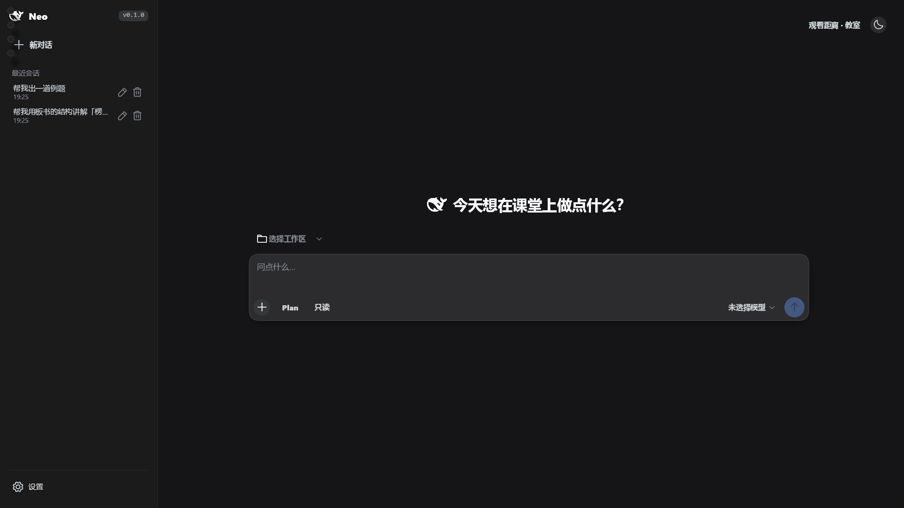
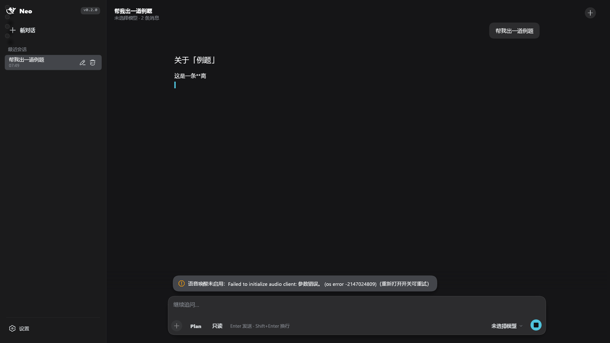
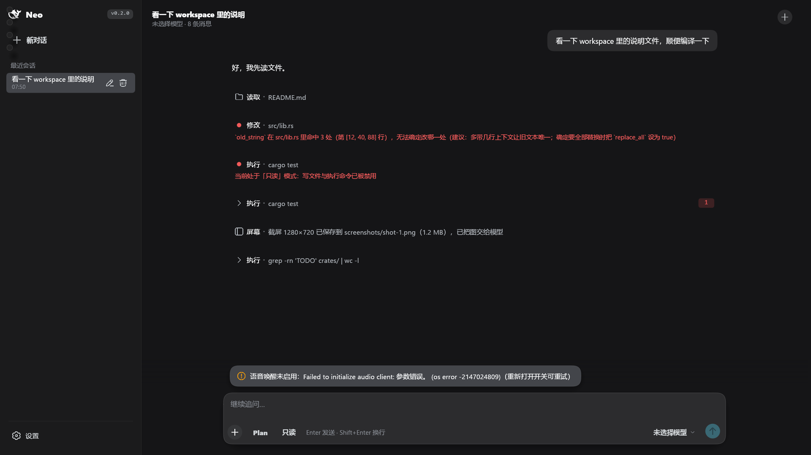
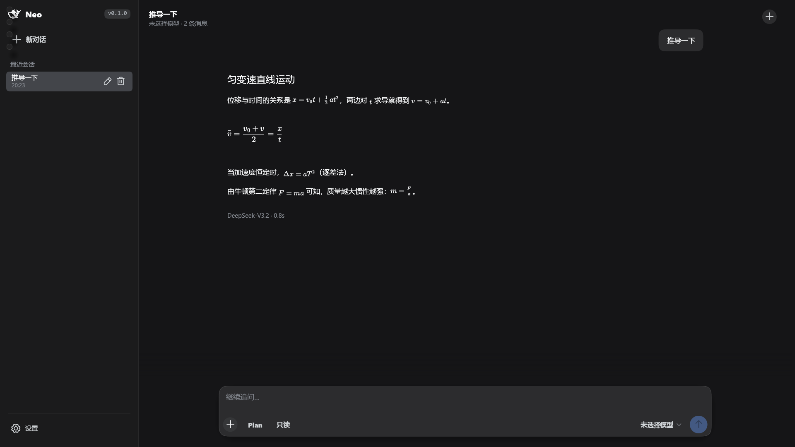
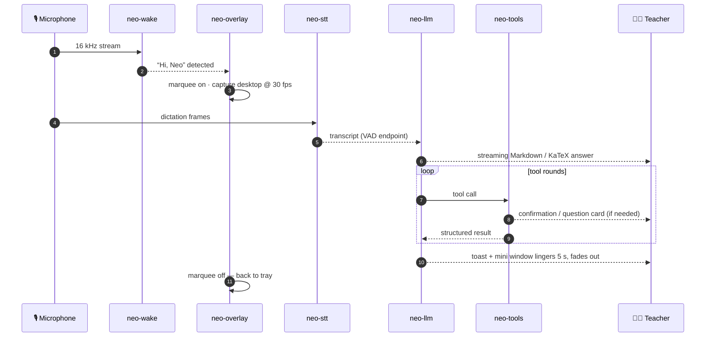
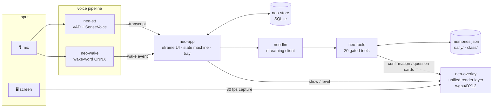
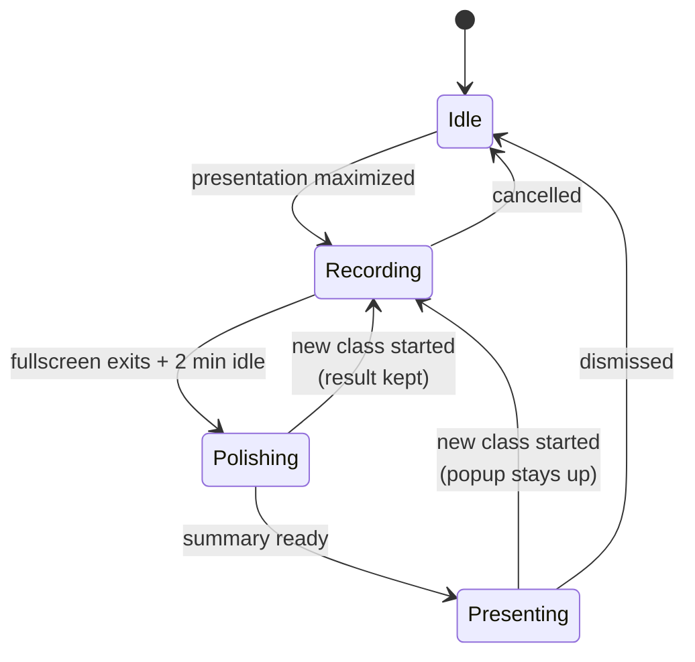

<div align="center">

# Neo

**A voice-first AI teaching assistant for classroom big screens.**

Say *“Hi, Neo”* — a liquid-glass lens wakes along the screen edges, refracting the live desktop
beneath a band of flowing color. Speak, and Neo transcribes, reasons, answers in streaming
Markdown / KaTeX, and operates the machine through a gated local tool chain. When the work
is done, it fades back into the system tray and waits for the next call.

[](https://github.com/ChidcGithub/Neo/releases)
[](https://github.com/ChidcGithub/Neo/actions/workflows/release.yml)
[](#requirements)
[](#build-from-source)
[](#license)

</div>

---

## Table of Contents

- [Overview](#overview)
- [Feature Highlights](#feature-highlights)
- [Screenshots](#screenshots)
- [The Voice Loop](#the-voice-loop)
- [Requirements](#requirements)
- [Download & Install](#download--install)
- [Build from Source](#build-from-source)
- [Architecture](#architecture)
- [Classroom Mode](#classroom-mode)
- [Memory](#memory)
- [Tool Chain](#tool-chain)
- [Safety & Privacy](#safety--privacy)
- [Versioning & Releasing](#versioning--releasing)
- [Design Principles](#design-principles)
- [Acknowledgments](#acknowledgments)
- [License](#license)

## Overview

Neo is a Windows desktop AI assistant built for **classroom big screens** — touch
all-in-ones running at 1080p or 4K, read from several meters away. It is designed around
three observations about real classrooms:

1. **The teacher's hands are busy.** The primary interface is voice: wake word →
   dictation → answer. Everything else is secondary.
2. **The screen belongs to the lesson.** Neo must be *absent* until called — no taskbar
   icon competing for attention, no window chrome over the slides. When it does appear,
   it appears as light: a lens of flowing color along the edges, a small card in the
   corner, a question dialog in the center — then it leaves.
3. **Classroom machines are hostile environments.** Spotty networks, aggressive
   antivirus, no admin rights, and an audience. Neo's audio pipeline is fully offline,
   its installer is per-user (no UAC), and every mutating tool call is gated behind an
   explicit on-screen confirmation.

The visual language is adapted from **DeepSeek Harness** (`@deepseek-ai/dsh`).
Big-screen and touch adaptation, the voice pipeline, the liquid-glass overlay, the
classroom monitor, and the tool chain are original work — independent implementations,
not upstream ports.

## Feature Highlights

| | |
|---|---|
| 🎙️ **On-device wake word** | Re-implementation of the `livekit-wakeword` inference chain (mel → speaker embedding → wake classifier) on local ONNX models. 16 kHz input, 80 ms frames, 2 s sliding window. |
| 🗣️ **Offline speech-to-text** | Silero VAD endpointing + SenseVoice-Small (int8) via in-process sherpa-onnx. Zero network dependency. |
| 🌊 **Liquid-glass marquee** | Fullscreen transparent overlay on DX12 + DirectComposition: live desktop capture drives real-time **refraction with chromatic dispersion, Fresnel rim light, and roughness blur**, wrapped in a seven-color pastel band that hugs the screen edges — corners included. Breathes with the mic level. |
| 🪟 **Unified render layer** | Mini window, confirmation cards, class summaries and effect flashes are all *cards on one persistent overlay* — no auxiliary windows are ever created, so none of them can flash black. Cards hit-test precisely; clicks fall through everywhere else. |
| 💬 **Streaming conversation** | OpenAI-compatible `/chat/completions` client (DeepSeek by default) with CommonMark + KaTeX rendering (a Rust port of KaTeX's layout). Cancellable at any moment — even mid-tool-execution. |
| 🛠️ **Gated local tools** | 20 tools: files, documents, shell (PowerShell + bundled Git Bash), screenshots, UIA automation, web search, memory. Write/exec actions require on-screen confirmation first. |
| ❓ **Ask-the-user tool** | When the model is unsure, `ask_user` pops a question card with tappable options instead of guessing. |
| 🧠 **Three-tier memory** | Long-term profile (`remember`/`forget`, injected into every prompt) · **daily notes** with a gist index (`note_day`/`recall_day`, index-first lookup) · per-day **class notes** written by the classroom monitor. |
| 🖥️ **Classroom mode** | Detects when a presentation goes fullscreen → silently captures + transcribes the lesson → polishes a summary when the class ends → slides in a summary card. A tiny red dot in the corner marks summary start/finish. |
| 🪟 **Mini window** | While Neo works in the background: tool flow + reply body (Markdown/LaTeX) in a corner card that dodges the cursor, auto-sizes to the final paragraph, and fades out after a 5 s dwell. |
| 🔔 **Native notifications** | Windows toasts on startup and task completion; the release build never flashes a console window. |

## Screenshots

| Conversation · dark · 1080p | Generating (stoppable) |
|:---:|:---:|
|  |  |

| Tool cards | Math rendering (KaTeX port) | Mini window (done state) |
|:---:|:---:|:---:|
|  |  |  |

<details>
<summary><b>More snapshots</b> — light theme, 4K far-view, confirmation dialogs, settings</summary>
<br>

The full gallery lives in [`docs/screens/`](docs/screens/), including:

- Light theme & 4K far-view states
- Tool confirmation dialogs (normal / long-content / scrolled)
- Settings panels (appearance, model, display)
- Attachment chips & CommonMark edge cases (tables, nested lists, reference links)
- Session action sheets & reasoning traces

All snapshots are produced by the offscreen render tests (`cargo test`), so they never
drift far from what the app actually draws.

</details>

## The Voice Loop


```mermaid
sequenceDiagram
    autonumber
    participant Mic as 🎙️ Microphone
    participant Wake as neo-wake
    participant Overlay as neo-overlay
    participant STT as neo-stt
    participant LLM as neo-llm
    participant Tools as neo-tools
    participant User as 👩‍🏫 Teacher

    Mic->>Wake: 16 kHz stream
    Wake-->>Overlay: “Hi, Neo” detected
    Overlay->>Overlay: marquee on · capture desktop @ 30 fps
    Mic->>STT: dictation frames
    STT-->>LLM: transcript (VAD endpoint)
    LLM-->>User: streaming Markdown / KaTeX answer
    loop tool rounds
        LLM->>Tools: tool call
        Tools-->>User: confirmation / question card (if needed)
        Tools-->>LLM: structured result
    end
    LLM-->>User: toast + mini window lingers 5 s, fades out
    Overlay->>Overlay: marquee off — back to tray
```

## Requirements

| Requirement | Notes |
|---|---|
| **Windows 10 2004 (20H1) or later** | Capture exclusion (`WDA_EXCLUDEFROMCAPTURE`) is available from 2004 onward. |
| **DX12 or OpenGL-capable GPU** | DX12 is preferred; OpenGL is the main-window fallback. The desktop-refraction overlay requires DX12. |
| **Microphone** | For wake word & dictation. Everything else works without one. |
| **Rust 1.95+** | Only for building from source. |

> [!NOTE]
> On pre-2004 builds, or in remote sessions where capture exclusion fails, Neo still
> runs — the overlay degrades to a halo-only mode (no desktop refraction), so the
> marquee can never feed back into its own capture.

### Automatic renderer selection

On first launch (and after a version change), Neo tests **DX12 first, then OpenGL**
inside separate, time-limited processes. Vulkan is deliberately excluded because
some drivers crash during enumeration. The compact, square-cornered startup card
shows an indeterminate progress bar flush with its bottom edge during initialization.

The working renderer is cached in `%APPDATA%\Neo\graphics.json` (or
`NEO_HOME/graphics.json`). If initialization crashes before the first main-window
frame is confirmed, the **next launch** skips that backend. OpenGL mode uses the
existing auxiliary-window fallback without the DX12 refraction overlay.

After updating a faulty graphics driver, close Neo and run `neo.exe --reset-renderer`
to probe again. The cache directory must be writable; initialization guidance is
written to `graphics-help.txt` in the startup log directory on failure.

## Download & Install

Pre-built artifacts are published on the
[Releases](https://github.com/ChidcGithub/Neo/releases) page:

| Artifact | Shape | Pick it if… |
|---|---|---|
| `neo-<ver>-installer-x64.exe` | NSIS wizard (per-user, **no admin rights needed**) | You want Start Menu / Desktop shortcuts and an entry in *Apps & Features* |
| `neo-<ver>-portable-x64.zip` | Zip with everything inside | You want to unpack-and-run, or keep it on a USB stick |

Both bundles contain the same payload: `neo.exe`, wake-word models, STT models
(SenseVoice int8 + Silero VAD), and a portable Git Bash runtime for the Bash tool.

> [!TIP]
> The installer is unsigned for now — SmartScreen will warn once. User data
> (database, memories) lives in `%APPDATA%\Neo` and survives uninstalls.

## Build from Source

```bash
cargo run --release   # release is strongly recommended: 60 fps at 4K
cargo test            # unit tests + offscreen render snapshots (output: docs/screens/)
```

### Model & runtime assets

| Asset | Location | Source |
|---|---|---|
| Wake-word models (~3 MB) | `crates/neo-wake/assets/` | **Vendored in the repo** — nothing to do |
| STT models (~240 MB) | `crates/neo-stt/assets/` (git-ignored) | `sense-voice/model.int8.onnx` + `tokens.txt`, and `vad/silero_vad.onnx` from the official sherpa-onnx releases; or point `NEO_STT_MODEL_DIR` at any directory containing them |
| Portable Git Bash (~91 MB) | `runtime/` (git-ignored) | `python tools/fetch_runtime.py` |

> [!IMPORTANT]
> Missing STT models disable only voice transcription; a missing runtime disables only
> the Bash tool. Everything else works.

## Architecture


```mermaid
flowchart LR
    subgraph Input
        Mic[🎙️ mic]
        Screen[🖥️ screen]
    end

    subgraph Voice["voice pipeline"]
        Wake[neo-wake<br/>wake-word ONNX]
        STT[neo-stt<br/>VAD + SenseVoice]
    end

    App[neo-app<br/>eframe UI · state machine · tray]
    Overlay[neo-overlay<br/>unified render layer<br/>wgpu/DX12]
    LLM[neo-llm<br/>streaming client]
    Tools[neo-tools<br/>20 gated tools]
    Store[(neo-store<br/>SQLite)]
    FS[(memories.json<br/>daily/ · class/)]

    Mic --> Wake -->|wake event| App
    Mic --> STT -->|transcript| App
    App -->|show / level| Overlay
    Screen -->|30 fps capture| Overlay
    App --> LLM --> Tools
    Tools -->|confirmation / question cards| Overlay
    App <--> Store
    Tools <--> FS
```

| Crate | Responsibility |
|---|---|
| `neo-app` | Main binary: eframe UI, voice state machine, tray, per-turn orchestration |
| `neo-ui` | Custom-drawn component library (buttons, modals, lists, badges, fields, …) |
| `neo-theme` | Design system: semantic palette, metrics & scaling chain, fonts, squircle corners |
| `neo-llm` | OpenAI-compatible streaming client; function-calling protocol transport |
| `neo-tools` | Tool spec / confirmation policy / execution / result presentation |
| `neo-wake` | Wake-word engine (mic → mel → embedding → scoring) |
| `neo-stt` | Offline speech-to-text (Silero VAD + SenseVoice int8) |
| `neo-overlay` | The one always-on-top transparent window: marquee + all cards, shared GPU |
| `neo-store` | Session & message persistence (SQLite, WAL) |

## Classroom Mode

When a teacher opens a slide deck fullscreen, Neo starts an eyes-and-ears session in
the background — no interaction needed:


```mermaid
stateDiagram-v2
    [*] --> Idle
    Idle --> Recording: presentation maximized
    Recording --> Polishing: fullscreen exits + 2 min idle
    Recording --> Idle: cancelled
    Polishing --> Presenting: summary ready
    Polishing --> Recording: new class started<br/>(result kept)
    Presenting --> Recording: new class started<br/>(popup stays up)
    Presenting --> Idle: dismissed
```

- **Recording** — silent screenshots (no flash, no self-capture) are analyzed by the
  vision model while lesson audio is transcribed continuously. STT engines are reused
  across classes, not reloaded.
- **Polishing** — screen notes + transcript are condensed into a ≤ 1500-character
  summary. A **small red dot** in the top-left corner marks the start and finish of
  this phase (5 s each).
- **Presenting** — the summary slides in from the top as a Markdown card, and is filed
  under per-day class notes (`class/YYYY-MM-DD.json`) with a one-line pointer appended
  to long-term memory.

## Memory

Neo keeps three deliberately separate kinds of memory:

| Tier | Where | Written by | Read by the model |
|---|---|---|---|
| **Long-term** | `memories.json` | `remember` tool / settings UI | Injected into every system prompt (≤ 50 entries, 3000 chars) |
| **Daily notes** | `daily/YYYY-MM-DD.json` + `index.json` | `note_day` tool (silent observations, e.g. off-task screen content) | `recall_day` — **index first**, then the day file |
| **Class notes** | `class/YYYY-MM-DD.json` | classroom monitor | via `recall_day` (subject + summary) |

The daily index is double-capped (120 days / 4000 chars, oldest dropped first) so
lookup stays O(small) forever. All memory files are atomic-write JSON with `.bad`
quarantine on corruption, and live next to the database in `%APPDATA%\Neo`.

## Tool Chain

Every tool declares its parameters, preview line, and risk level once; the JSON schema,
the confirmation policy, and the docs are derived from that single declaration.

| Risk | Tools | Policy |
|---|---|---|
| `read` | read_file · read_document · view_image · web_search · recall_day · screenshot · screen_elements · screen_element_search | run immediately |
| `open` | open_file · open_app · remember · forget · note_day | run immediately (machine state untouched) |
| `ask` | ask_user | the popup *is* the answer path — replies flow back as the tool result |
| `write` | write_file · edit_file | on-screen confirmation |
| `exec` | powershell · bash · click · drag | on-screen confirmation |

> [!WARNING]
> While any Agent task is running — including text generation and non-mouse tools —
> a screen click requests interrupt confirmation, in both foreground and background.
> Starting/submitting a task and interacting with approval, question, or summary cards
> do not count as interrupt requests. Neo cancels only after an explicit confirmation;
> during an active desktop operation the request waits until the confirmation UI can
> safely appear. A Windows mouse hook distinguishes physical clicks from injected
> mouse input. If the hook is unavailable, conservative polling is used instead and
> physical clicks within one second of injected input may be ignored.

## Safety & Privacy

- **Voice stays on the machine.** Wake word and STT are fully offline ONNX models.
- **The LLM is the only network dependency** (plus `web_search`, only when invoked).
- **The overlay excludes itself from capture** (`WDA_EXCLUDEFROMCAPTURE`), so lesson
  screenshots, recordings, and meeting shares never contain the marquee or the cards.
- **No admin rights, ever.** Per-user install, per-user data, per-user registry hive.
- **Classroom monitoring is local-first**: screenshots are analyzed by the configured
  vision model; transcripts and notes never leave the machine except through that
  configured endpoint.

## Versioning & Releasing

The single source of truth is `[workspace.package].version` in the root
[`Cargo.toml`](Cargo.toml); every crate inherits it, and the UI reads it via
`env!("CARGO_PKG_VERSION")`.

Pushing a `v*` tag triggers the release pipeline:


```mermaid
flowchart LR
    Tag([git tag v*]) --> Build[ cargo build --release ]
    Build --> Assets[STT models + MinGit runtime]
    Assets --> Zip[[portable-x64.zip]]
    Assets --> Art[make_installer_art.py<br/>whale icon · wizard bitmaps]
    Art --> NSIS[[installer-x64.exe]]
    Zip --> Release([GitHub Release<br/>auto changelog])
    NSIS --> Release
```

## Design Principles

1. **Visual fidelity first; adaptation through non-visual channels.** The upstream
   shape language (corner radii, button sizes, type rhythm) is never re-invented.
   Big-screen adaptation is uniform proportional scaling plus a 48 pt touch floor.
2. **Scaling must be visible.** The final scale-factor formula is printed in full in
   the settings panel, so on-site troubleshooting starts with the answer on screen.
3. **Keep egui for what it does best.** Text editing and scroll clipping use native
   egui; everything else is custom-drawn.
4. **No window may ever flash black.** Auxiliary UI is drawn as cards on the persistent
   overlay; offscreen test paths keep the old viewports so snapshots stay honest.
5. **If it can break in a classroom, it breaks loudly in a test.** Dead streams,
   poisoned locks, panicking workers, 49-day uptime wraps — each has a regression test.

## Acknowledgments

- [DeepSeek Harness](https://github.com/deepseek-ai) (`@deepseek-ai/dsh`) — visual language
- [livekit-wakeword](https://github.com/livekit) — wake-word inference chain design
- [sherpa-onnx](https://github.com/k2-fsa/sherpa-onnx) — in-process ONNX inference (SenseVoice, Silero VAD)
- [ratex](https://crates.io/crates/ratex) — KaTeX's layout, ported to Rust
- [egui](https://github.com/emilk/egui) / [wgpu](https://github.com/gfx-rs/wgpu) — UI & rendering foundations

## License

[MIT](LICENSE)
